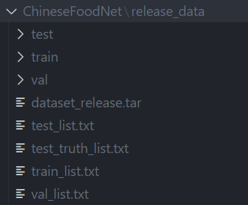

# ChineseFoodNet-ResNet50-Efficient-CBAM

主要功能为使用Resnet50在ChineseFoodNet上进行训练，搭建分类网络。增添了EfficientNet 

## About ChineseFoodNet

这个是一个关于中国传统食物图片的数据集。其中包含了208类食物，数据集图片总量大小约20G，数量约18W，关于数据集的详细描述可以参见[ChineseFoodNet](https://sites.google.com/view/chinesefoodnet/)。

本项目基于 [powerli2002/ChineseFoodNet-Resnet50](https://github.com/powerli2002/ChineseFoodNet-Resnet50) 和 [zTrix/sata-license](https://github.com/zTrix/sata-license) 开发，并做了如下修改：

## 原作者信息

- ChineseFoodNet-ResNet50 项目原作者：李子健 (li_zijian@foxmail.com)
- 版权声明：版权所有 © 2023 李子健

## 原项目地址

- https://github.com/powerli2002/ChineseFoodNet-Resnet50  
- https://github.com/zTrix/sata-license

## 本项目修改内容

- 引入 EfficientNet 
- 增加模型测试脚本
- 添加图表分析与可视化功能

## 项目地址

当前项目地址：[https://github.com/FrankerDt/ChineseFoodNet-Resnet.effcient]

## License

本项目遵循原作者许可协议（[SATA License](https://github.com/zTrix/sata-license)），如您 Fork 或二次分发，请遵循相应条款。

以下为原项目的README

# ChineseFoodNet-ResNet50-Efficient-CBAM

主要功能为使用Resnet50在ChineseFoodNet上进行训练，搭建分类网络。

这个是一个关于中国传统食物图片的数据集。其中包含了208类食物，数据集图片总量大小约20G，数量约18W，

# Chinese traditional food picture classification

主要功能为使用Resnet50在ChineseFoodNet上进行训练，搭建分类网络。

## 2024.12.24 Update

1. 添加了原论文中的数据增强功能。直接输入图片训练无法达到数据集精度，依据论文中的数据增强方法进行训练，（输入前进行随机裁剪和50%水平翻转），有效抑制了模型过拟合趋势。
2. 添加了融合cbam 进行模型训练的模块，包括训练代码train_cbam.py，网络实现代码resnet_cbam.py。本次选择在BottleNeck的三层卷积层后依次加入通道注意力和空间注意力模块。（添加cbam模块后可以正常加载预训练权重）
3. 在最新的训练代码中，加入了对wandb的适配。

### Performance Comparison

| Model Accuracy       | Val Top 1 | Val Top 5 | Test Top 1 | Test Top 5 |
| -------------------- | --------- | --------- | ---------- | ---------- |
| ResNet50             | 68.14%    | 86.51%    | 68.39%     | 86.61%     |
| ResNet50 + DA        | 78.88%    | 93.06%    | 79.23%     | 93.49%     |
| ResNet50 + DA + CBAM | 79.67%    | 93.71%    | 80.25%     | 93.78%     |

## Specific implementation

1. 实现了使用Resnet50训练，并达到测试集与验证集上top1 70%，top5 90%的精度。
2. 模型具有保存和读取功能。
3. 添加了计算top1和top5 accuracy的函数，可计算train，test，valid等数据集上的准确率

## Usage

PyTorch实现版本为1.8.1。

1.将数据集下载到ChineseFoodNet文件夹：

数据集下载：
https://pan.baidu.com/s/19lPkSGhMwe5QLLXHNOu-Zw?pwd=7rur

2.项目根目录创建model_data文件夹，权重放入model_data文件夹下。

训练权重下载：
链接: https://pan.baidu.com/s/1szYn5OTT01eNCkwr2fWTQA?pwd=w2uj

此权重实现效果：
| Accuracy   | Top 1 | Top 5  |
|----------|--------------|--------------|
| Train | 97.28%       | 99.83%       |
| Valid | 68.76%       | 90.95%       |
| Test  | 68.93%       | 91.09%       |

3.cal_top5acc.py ，cal_top1acc.py 可切换验证集，测试集。修改dataset_test即可。

# References

- Chen X, Zhu Y, Zhou H, et al. Chinesefoodnet: A large-scale image dataset for chinese food recognition[J]. arXiv preprint arXiv:1705.02743, 2017.
- He K, Zhang X, Ren S, et al. Deep residual learning for image recognition[C]//Proceedings of the IEEE conference on computer vision and pattern recognition. 2016: 770-778.
- https://github.com/paradiseDust/ChineseFoodNet-EffiNet-L2
- Woo S, Park J, Lee J, et al. CBAM: Convolutional Block Attention Module[J]. arXiv preprint arXiv:1807.06521, 2018.
